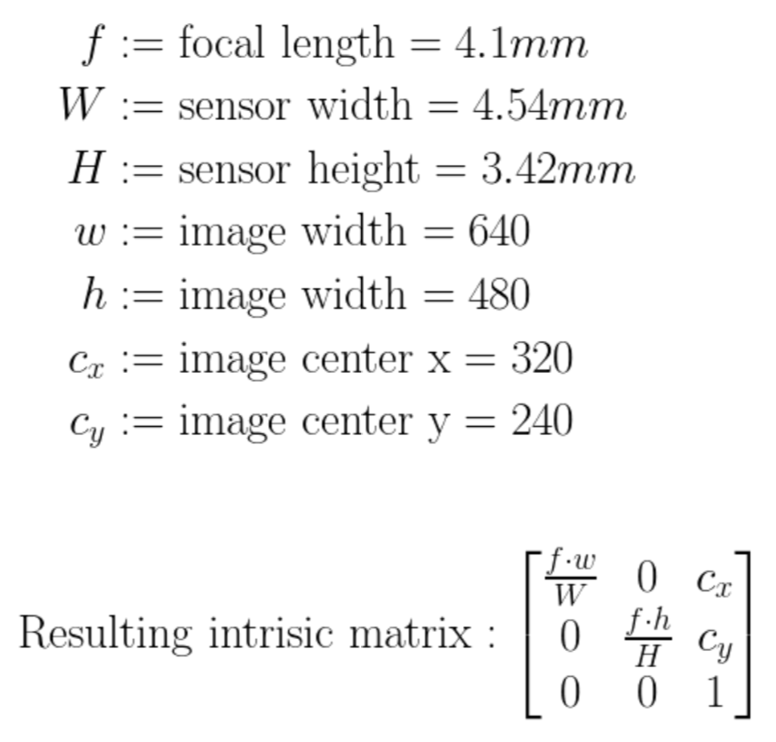

# 3D Reconstruction (Microsoft Kinetic v1)
Use camera intrinsics, extrinsics and camera pose to reconstruct the 3D scene from Microsoft Kinetic sensor.

## Dependencies
Eigen
FreeImage

## Get Started
1. Clone the repository and navigate to this folder
```
git clone https://github.com/YangLiu14/deep-learning-examples.git
cd deep-learning-examples/computer_vision/3D_Scanning_and_Motion_Capture/3D_reconstruction/
```

2. Download data
The data is provided by TUM (Technical University of Munich) Computer Vision Group. [Download link](https://vision.in.tum.de/data/datasets/rgbd-dataset/download). Here we only need the `fr1/xyz`. Download and unzip it into the `data` folder.

3. Dependencies
[Eigen](https://eigen.tuxfamily.org/dox/GettingStarted.html). It's suggested to download and extract the source code and put it in the `/libs/` folder
FreeImage

4. Build
```
mkdir build && cd build
cmake ../src/
make 
```


## Background Knowledge

### Pinhole model
https://www.ics.uci.edu/~majumder/vispercep/cameracalib.pdf

### Camera Intrinsics and Extrinsic
- Intrinsics:
The intrinsic matrix can be calculated by:
 <!-- .element height="50%" width="50%" -->

- Extrinsics:
http://ksimek.github.io/2012/08/22/extrinsic/

- Projection from World to Pixel
 


### Back Project from depth-map to world coordinates
Use the the equations in the "world --> pixel" step, and reverse calculate from the P_pixel [x_p, y_p] (from depth camera) to world coordinates [x_w, y_w, z_w, 1].

Once we have the world coordinates, we can also take the RGBD-colors directly and store it the same order as we store the world-coordinates.

### Write Mesh File
    - [OFF file](http://www.geomview.org/docs/html/OFF.html) format, example:
    
```
   COEF
   # numVertices numFaces numEdges(not checks, simply set 0)
   4 2 0
   # list of vertics
   # X Y Z R G B A
   0.0 1.0 0.0 255 255 255 255
   0.0 0.0 0.0 255 255 255 255
   1.0 0.0 0.0 255 255 255 255
   1.0 1.0 0.0 255 255 255 255
   # list of faces
   # nVerticesPerFace idx0 idx1 idx2 ... 
   # 'idx' is the index of the vertices, 3 vertices forms a triangle("face")
   # keep all the sequence of indexs below either all clockwise, 
   # or allcounter-clockwise
   3 0 5 1
   3 5 6 1
```
 


## Result


#### Reference
- TUM Lecture: (IN2354) 3D Scanning & Motion Capture, Year 2019.


