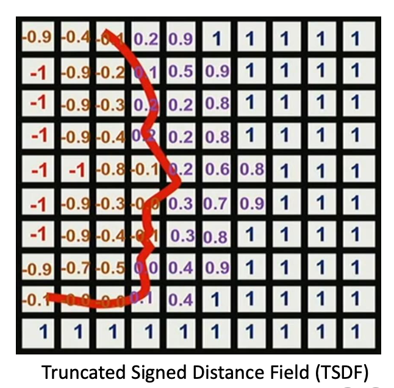
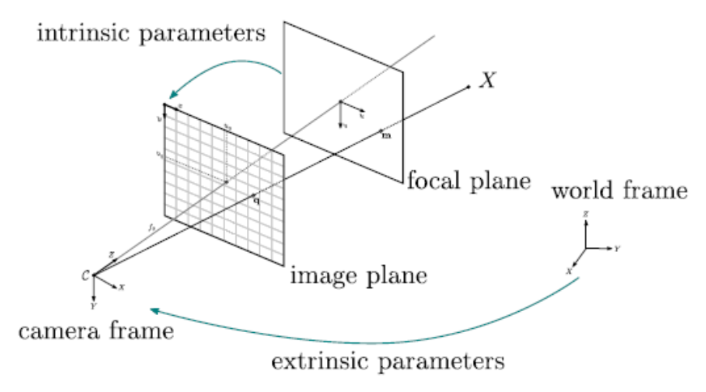
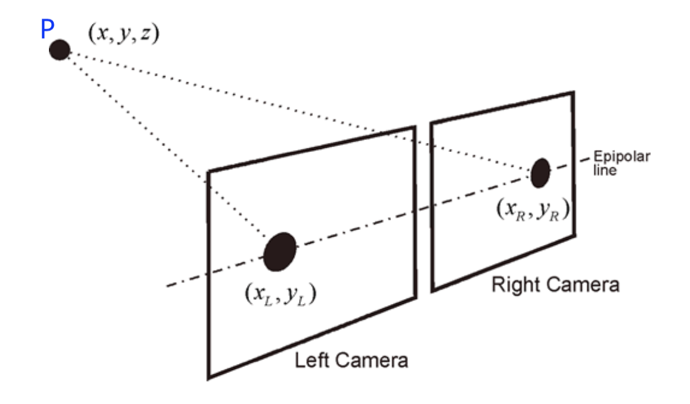
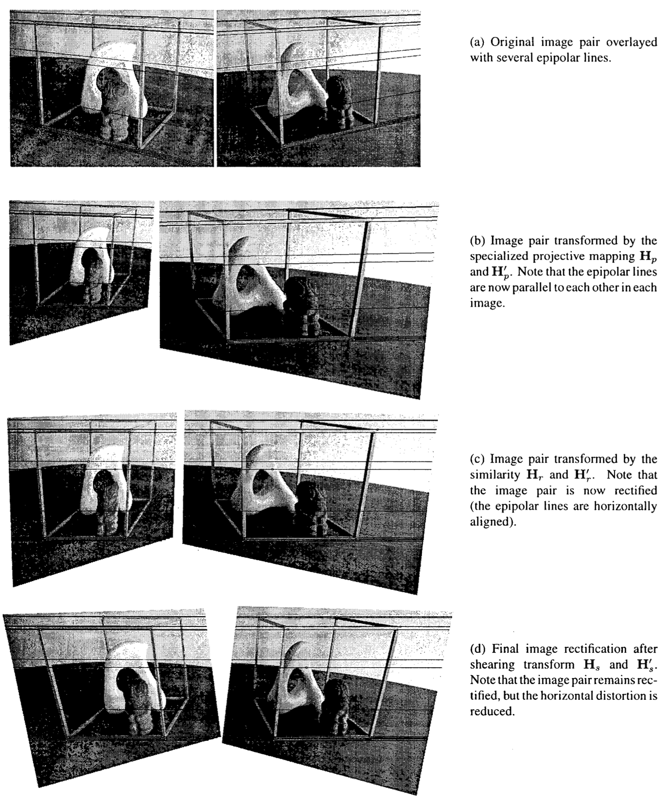
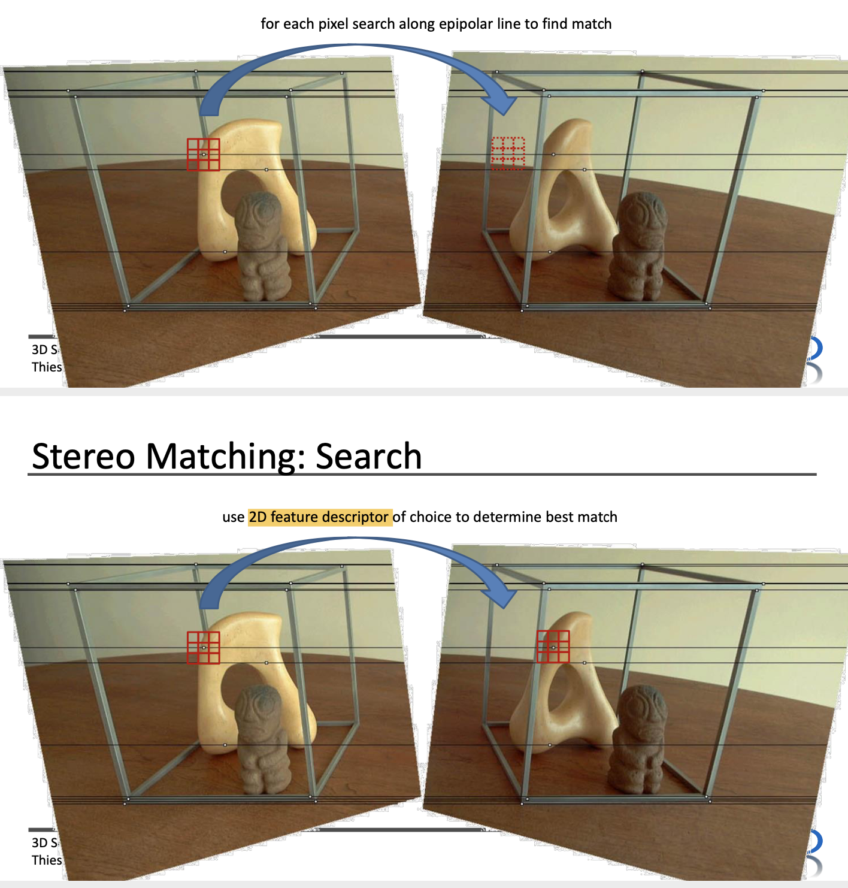

# Lecture 1 - Basic Concepts of Geometry

## 3D Data

### Point Clouds

-  Set of 3D points (x,y,z)
- attributes: color, normal
- typically "raw" measurements (no inter- or extrapolation, no surface defined)

### Meshes

- Vertices + Faces (often triangles)
- Piecewise linear （分段线性）
  - attributes: colors, normals, textures

### Parametric surfaces

A parametric surface is defined by parametric equation with two parameters $\vec{r}: \mathbb{R}^2 \rightarrow \mathbb{R}^3$

- Spines, NURBS(Non-uniform rational basis spine), subdivs
- Set of points that define control grid

Example: the simplest type of parametric surface is given by the graphs of functions of two variables:

$z=f(x,y), \quad \vec{r}=(x,y,f(x,y))$

### Implicit Surfaces

An implicit surface is a surface in Euclidean space defined by an equation:

$F(x,y,z) = 0$

The graph of a function is usually described by an equation $z = f(x,y)$ and is called **explicit representation**. You can simply rewrite this to $z - f(x,y)=0$, then this becomes implicit.

*Examples*:

1. plane: $x+2y-3z+1 = 0$
2. sphere: $x^2+y^2+z^2-4 = 0$
3. torus(圆环面): $[x^2+y^2+z^2+R^2-a^2]^2 - 4R^2(x^2+y^2) = 0$

e.g. signed distance field

## How to obtain 3D data

1. Modeled by artists
2. 3D scanning (MRI, CT, depth camera)

### Capture Devices

- Passive:
  - RGB
  - Stereo and Multi-view
- Active:
  - Time of Flight (ToF) (*Kinect_v2*)
  - Structured Light (*Kinect_v1*)
  - Laser Scanner, LIDAR

### Stereo Matching

- Triangulation using epipolar geometry

两个相机内部，这个物体相对于摄像机中心点位置有不同的坐标。两个相机相距$T_x$，焦距为f，物体P距离相机z（z也就是景深）。根据相似三角形可以的得到$z=f T_x/d$，有了z相当于就有了深度图。d是displacement（https://en.wikipedia.org/wiki/Computer_stereo_vision）

- Finding **correspondences** is **hard**.

### How to find matching points between images

**Rectification**

Image rectification is a transformation process used to project images onto a common image plane.

Finding matches in stereo vision is restricted by [epipolar geometry](https://en.wikipedia.org/wiki/Epipolar_geometry): Each pixel's match in another image can only be found on a line called the **epipolar line**.  [wiki](https://en.wikipedia.org/wiki/Image_rectification)

(a) Find epipolar lines in both images

(b) Transform the image pair so that the epipolar lines are now parallel to each other in each image

(c) Transform the image pair so that epipolar lines are aligned.

(d) 

**Search**

$SSD(u,v) = \sum_{(u,v)}(I_{left}(i,j) - I_{right}(i,j))^2$ ❓

**Stereo Matching: Sparse features**: SIFT, SURF, ORB, ...

**Stereo Matching: Search**: Size of search window:

- small neighborhood -> more noise
- larger neighborhood -> fewer details

**Stereo Matching with DL**: e.g. Siamese Networks.

### Stereo Matching: Baseline

- Wide baseline -> harder to find matches

  左右相机相隔很远则很难找到match，因为左右图片的重合景象会很少

  - more distortion
  - more occlusions

- Small baseline -> matches are less accurate

  左右相机相隔很近，match则不是太准确

  - Small disparity error results in large distance
  - Disparity(差异) needs to be sub-pixel accurate

(Baseline: 左右相机相距的距离)

理解：回想公式：$z = \frac{f T_x}{d} => d = \frac{f T_x}{z}$, 当Tx很小(small baseline)，z很大(large distance)的时候，disparcity error当然就很小，有时候小到比一个pixel的宽度还要小。

### Time of Flight

measure the distance between a sensor and an object, based on time difference between the emission of a signal and its return to the sensor, after being reflected by an object.

Use **Infrared light (红外线)**: 

- less disturbance, easier distinction from natural ambient light.

### Structured Light

is a process of projecting a **known pattern** on to a scene. The way that these patterns deform when striking surfaces allows vision systems to calculate the depth and surface information of the objects.

### Lidar  (light detection and ranging, 3D laser scanning)

is a method that measures distance of a target by illuminating the target with **laser light** and measuring the **reflected light** with a sensor. Also use **time difference** to make digital 3D representation of the target.

## Depth Camheras 小总结

- **Stereo and Multi-view**
  - passive: work indoors and outdoors
  - Reply on features frome environment
  - Computationally expensive due to **feature matching** step
- **Time of Flight (ToF)**
  - Active: can map **featureless** region
  - Often in IR spectrum -> **falis outdoors**
  - Sensitive to scattering, indirect lighting, etc.
- **Structured Light**
  - Active: can map **featureless** regions
  - Often in IR spectrum -> **falis outdoors**
  - Need **precise calibration** between projector and sensor
- **Laser Scanner, Lidar**
  - can work in direct sunlight
  - Only a **small scanline** --> slow (if faster, only sparse points)
  - Very precise though because feature matching is trivial

### Reference

Stereo Matching: https://blog.csdn.net/Tommy_wxie/article/details/75080647

